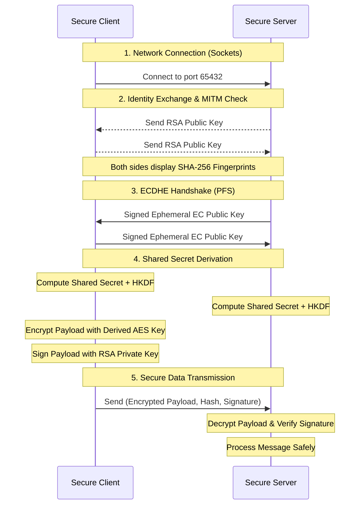

# PROJECT REPORT: DESIGN AND IMPLEMENTATION OF SECURE COMMUNICATION SYSTEM USING HYBRID CRYPTOGRAPHIC TECHNIQUES

**Assignment:** Cryptography and Network Security (BCY602)
**Application:** Encrypted Client-Server Communication with Authentication
**Group Members:**

- Sharath (Roll No: [Insert])

---

## 1. Introduction to Chosen Algorithms

To secure the transmission of highly sensitive data between our client and server, we utilized a combination of symmetric and asymmetric cryptographic algorithms:

1. **RSA (Rivest–Shamir–Adleman) (2048-bit):** Used for **Identity Verification and Authentication**. Each node has a static RSA keypair to prove its identity via digital signatures.
2. **ECDHE (Elliptic Curve Diffie-Hellman Ephemeral):** Used for **Perfect Forward Secrecy (PFS)**. Instead of RSA key transport, we use the SECP256R1 curve to derive a shared session key. Since keys are ephemeral, compromise of the long-term RSA key does not expose past sessions.
3. **AES-256 (Advanced Encryption Standard) (CBC Mode):** Used for the actual data transmission of the payload.
4. **SHA-256 (Secure Hash Algorithm):** Used for Data Integrity and **Public Key Fingerprinting** to prevent MITM attacks.
5. **RSA-PSS Digital Signature:** Used for Authentication and protection of the ECDHE handshake.

## 2. System Architecture Diagram

## 3. Working Screenshots

*(Please insert screenshots here after running the code locally. Take one screenshot of the Server Terminal showing the decrypted message and validation steps, and one screenshot of the Client terminal showing the secure key exchange process).*

## 4. Security Analysis

Our implementation addresses the fundamental pillars of information security:
1. **Confidentiality:** Data is encrypted using AES-256. 
2. **Integrity:** SHA-256 ensures that if an attacker alters even a single bit of the encrypted payload, the hash will drastically change upon decryption.
3. **Authentication & Non-Repudiation:** RSA-PSS digital signatures guarantee that the payload could only have been generated by the holder of the specific Client Private Key.
4. **MITM Protection:** By displaying **SHA-256 Fingerprints** of the static RSA keys, users can verify identities out-of-band, preventing intercept-and-replace attacks.
5. **Perfect Forward Secrecy (PFS):** By using **ECDHE**, even if the long-term RSA private key is compromised in the future, past sessions remain secure as session keys are ephemeral and never transmitted.
5. **Secure Termination:** Memory pointers to the session key are cleared (`session_key = None`), and the socket gracefully closes automatically.

## 5. Limitations and Improvements

**Limitations:**
- **Manual Fingerprint Verification:** While fingerprints protect against MITM, they require out-of-band verification by the user.
- **Socket Plaintext Routing:** TCP headers (IPs, Ports) remain visible.

**Improvements:**
- Implement Public Key Infrastructure (PKI) by having a CA sign the public keys to automate the authentication process.
- Implement session resumption for efficiency.
